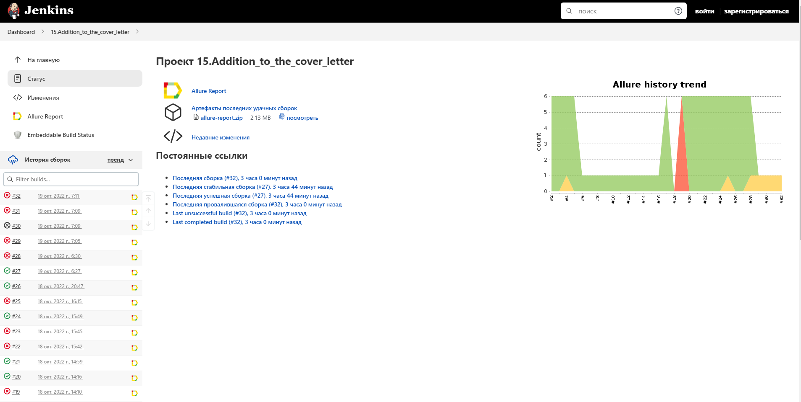

# Проект по автоматизации тестирования страницы Selecty
## :page_facing_up: Содержание:

* [Технологии и инструменты](#technologist-технологии-и-инструменты)
* [Реализованы проверки](#bookmark_tabs-реализованы-проверки)
* [Запуск тестов из терминала](#computer-Запуск-тестов-из-терминала)
* [Запуск тестов в Jenkins](#-запуск-тестов-в-jenkins)
* [Отчет о результатах тестирования в Allure Report](#-отчет-о-результатах-тестирования-в-allure-report)
* [Интеграция с Allure TestOps](#-интеграция-с-allure-testops)
* [Интеграция с Jira](#-интеграция-с-jira)
* [Уведомления в Telegram с использованием бота](#-уведомления-в-telegram-с-использованием-бота)
* [Пример запуска теста в Selenoid](#-пример-запуска-теста-в-selenoid)

## :computer: Использованный стек технологий

<p align="center">


</p>


> *В данном проекте автотесты написаны на <code><strong>*Java*</strong></code> с использованием фреймворка <code><strong>*Selenide*</strong></code> для UI-тестов.*
>
>*Для сборки проекта используется <code><strong>*Gradle*</strong></code>.*
>
>*<code><strong>*JUnit 5*</strong></code> используется как фреймворк для модульного тестирования.*
>
>*Запуск тестов выполняется из <code><strong>*Jenkins*</strong></code>.*
>
>*<code><strong>*Selenoid*</strong></code> используется для запуска браузеров в контейнерах  <code><strong>*Docker*</strong></code>.*
>
>*<code><strong>*Allure Report, Allure TestOps, Jira, Telegram Bot*</strong></code> используются для визуализации результатов тестирования.*

## :bookmark_tabs: Реализованы проверки

### &nbsp;&nbsp;&nbsp;&nbsp;&nbsp;&nbsp; UI


>- [x] *Проверка drop-down menu*
>- [x] *Проверка наличия публикаций в разделе "СМИ о нас"*
>- [x] *Проверка заголовков основных разделов при выборе русского и анлийского языка*
>- [x] *Проверка появления окна с видео*
>- [x] *Проверка появления окна с предупреждением о необходимости заполнения обязательных полей для отправки резюме*

____

## </a> Jenkins job
<a target="_blank" href="https://jenkins.autotests.cloud/job/nkramar_T1_Automated_Tests/">**Сборка в Jenkins**</a>
<p align="center">  
<a href="https://jenkins.autotests.cloud/job/nkramar_T1_Automated_Tests/"></a>  
</p>


### *Параметры сборки в Jenkins:*

- *BROWSER (браузер, по умолчанию chrome)*
- *BROWSER_VERSION (версия браузера, по умолчанию 100.0)*
- *BROWSER_SIZE (размер окна браузера, по умолчанию 1920x1080)*
- *TASK (запуск любого теста отдельно)*

____
## :keyboard: *Команды для запуска из терминала*

***Локальный запуск:***
```bash  
gradle clean t1_tests
```

***Удалённый запуск через Jenkins:***
```bash  
clean
${TASK}
-Dbrowser=${BROWSER}
-DbrowserVersion=${BROWSER_VERSION}
-DbrowserSize=${BROWSER_SIZE}

```

## </a> *Allure* <a target="_blank" href="https://jenkins.autotests.cloud/job/nkramar_T1_Automated_Tests/14/allure/">*отчёт*</a>